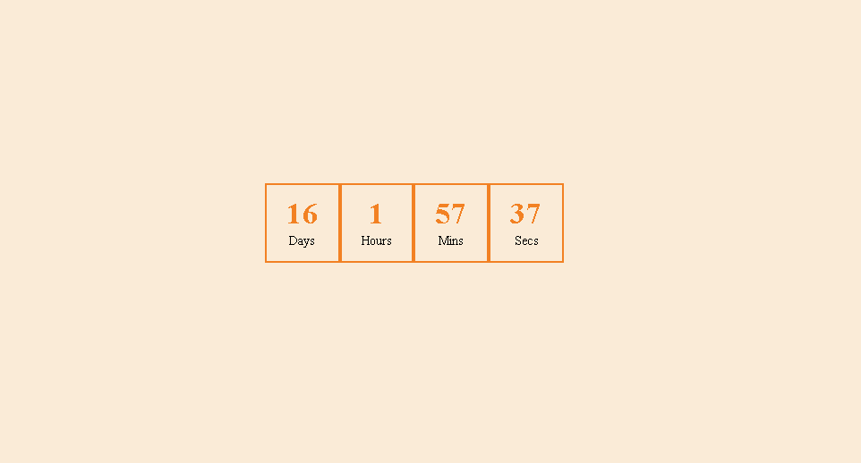

# React Countdown Timer

A simple countdown timer built with React.

## Features

- Real-time countdown
- Days, Hours, Minutes, and Seconds display
- Automatic stop when countdown reaches zero
- Responsive design

## Technologies

- React
- JavaScript
- CSS
- useState
- useEffect

## Preview



## Installation

```bash
npm install
npm run dev
```

## Author

Setareh Kazemi
